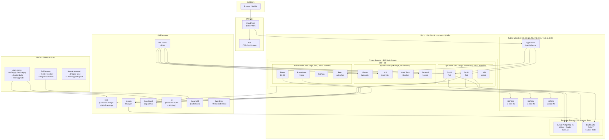
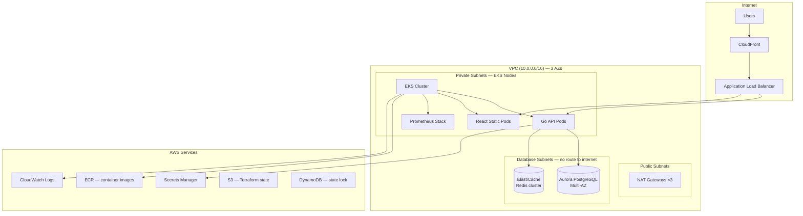

# production-platform

[](LICENSE)
[](https://www.terraform.io/)
[](https://aws.amazon.com/)
[](https://kubernetes.io/)
[](https://github.com/Kanim21/production-platform/actions/workflows/tflint-and-checkov.yml)

> **Reference architecture.** This repo is a portfolio piece. `terraform apply` is wired
> but intentionally gated behind manual `workflow_dispatch` — there is no live AWS account
> behind it. The CI pipeline (lint, validate, security scan) runs fully credential-less.
> To deploy it yourself, see [ADR-005](docs/adr/005-reference-architecture-not-deployed.md).



A production-grade AWS platform running a multi-tier e-commerce backend. Built to demonstrate the infrastructure patterns I reach for on day one: immutable infrastructure, GitOps delivery, defense-in-depth security, and operability as a first-class concern.

**Simulated workload:** 10,000 concurrent users, Black Friday traffic spikes (10×), sub-100ms API p99, 99.95% monthly uptime SLO.

---

## Architecture



---

## Tech Stack

| Layer | Technology | Why |
|---|---|---|
| IaC | Terraform 1.9 | Mature ecosystem, provider breadth, team familiarity ([ADR-002](docs/adr/002-terraform-over-cdk.md)) |
| Compute | EKS 1.30 (managed node groups) | Kubernetes portability, better bin-packing than ECS ([ADR-001](docs/adr/001-eks-over-ecs.md)) |
| Database | Aurora PostgreSQL 15 | Multi-AZ failover ~30s, storage auto-scaling, compatible with RDS Proxy |
| Networking | Custom VPC, 3-tier subnet design | Blast-radius isolation; database subnets have zero internet route |
| Ingress | AWS Load Balancer Controller + ALB | Native integration with WAF, ACM, and target group deregistration |
| Observability | kube-prometheus-stack + Loki | Full metrics/logs/alerts stack, no CloudWatch vendor lock-in ([ADR-003](docs/adr/003-prometheus-over-cloudwatch.md)) |
| CI/CD | GitHub Actions + OIDC | No static AWS keys anywhere; per-job short-lived credentials |
| Secret management | AWS Secrets Manager + IRSA | Pod-level IAM, no secret injection via env vars |
| Container registry | ECR with image scanning | Integrated vuln scanning; lifecycle policies keep costs down |
| CDN | CloudFront | Edge caching for static assets; WAF rules at the edge |

---

## Quick Start

```bash
# Prerequisites: AWS CLI, Terraform 1.9+, kubectl, helm, go 1.22+, node 20+
make dev-up          # Bootstrap dev environment end-to-end
make dev-down        # Tear it all down
make plan ENV=staging  # Preview staging changes
make apply ENV=prod    # Apply to prod (requires manual approval in CI)
```

### What `make dev-up` does

1. Validates AWS credentials and required tools
2. Creates S3 backend bucket + DynamoDB lock table for dev
3. Runs `terraform init && terraform apply -auto-approve` in `terraform/environments/dev`
4. Builds and pushes Docker images to ECR
5. Deploys kube-prometheus-stack via Helm
6. Deploys the application via Helm
7. Prints the ALB DNS name and Grafana URL

---

## Real-World Scenario

This models the infrastructure for an e-commerce backend serving ~10,000 concurrent users with these characteristics:

- **Read-heavy**: product catalog reads 95%, writes 5%
- **Spiky**: daily 8am–10pm traffic, flash sales at unpredictable times
- **Latency-sensitive**: checkout API must be < 200ms p99 or revenue drops
- **Data-sensitive**: PCI scope for payment metadata; GDPR for EU users

The Go API simulates catalog browsing, cart management, and order submission. Postgres handles orders and user accounts. Redis (not wired up in this scaffold) handles session state and catalog caching.

---

## Trade-offs I Made

**NAT Gateway per AZ vs. single NAT:** Higher cost (~$100/mo extra) in exchange for no cross-AZ NAT traffic during an AZ failure. For a latency-sensitive checkout flow, cross-AZ hops during a partial outage are unacceptable.

**Aurora over RDS single-instance:** Aurora's shared storage architecture means failover is ~30s (vs. ~60–120s for standard Multi-AZ RDS). For checkout, that's the difference between a user retry and an abandoned cart.

**kube-prometheus-stack over CloudWatch-only:** CloudWatch Metrics Insights queries are slow (15s+) for incident response. Prometheus queries are sub-second. We ship CloudWatch logs for compliance/retention but alert entirely from Prometheus. Full reasoning in [ADR-003](docs/adr/003-prometheus-over-cloudwatch.md).

**Spot instances for non-critical node groups:** ~70% cost reduction for batch/observability workloads. API pods run exclusively on on-demand nodes with PodDisruptionBudgets. Spot interruptions are handled by the Node Termination Handler.

**No service mesh (yet):** Istio/Linkerd adds operational complexity that isn't justified until we need mutual TLS between every pod or weighted traffic splitting. We get mTLS at the ALB→pod boundary via ACM and plan to revisit at 50+ services.

**RDS secret auto-rotation deferred:** Auto-rotation requires a VPC-resident Lambda that can reach both the Aurora endpoint and the Secrets Manager API. Shipping a placeholder ZIP that doesn't exist on disk causes `terraform apply` to fail and misrepresents the security posture. Rotation is manual via the [rotation runbook](docs/runbooks/rds-secret-rotation.md) until the [AWS SAR rotation template](docs/adr/004-rds-secret-rotation.md) is wired in.

---

## Failure Scenarios & Recovery

| Scenario | Detection | Automated Response | Manual Steps | RTO |
|---|---|---|---|---|
| EKS node failure | Node NotReady alert → PagerDuty | Cluster Autoscaler replaces node; pods reschedule | Verify replacement node healthy | < 5 min |
| AZ outage | CloudWatch AZ health + Prometheus node count | ALB health checks drain; EKS reschedules to remaining AZs | None for stateless; validate RDS failover | < 10 min |
| Aurora primary failure | RDS Events → SNS | Aurora auto-promotes replica; DNS CNAME flips | Update Secrets Manager endpoint if using static DNS | ~30s DB, < 5 min app |
| Ingress degraded (ALB 5xx spike) | Prometheus alert `IngressHighErrorRate` | None — requires investigation | See [runbook](docs/runbooks/ingress-degraded.md) | 15 min |
| Bad deploy | Deployment rollout stalled alert | None automatic | `kubectl rollout undo deployment/api` or Helm rollback | < 5 min |
| Secrets leak | GuardDuty + manual | None | Rotate in Secrets Manager; pods pick up on next restart via IRSA | < 30 min |

Runbooks: [node failure](docs/runbooks/node-failure.md) · [RDS failover](docs/runbooks/rds-failover.md) · [ingress degraded](docs/runbooks/ingress-degraded.md)

---

## Scaling to 1M Users (100× current load)

The current design hits predictable ceilings. Here's the upgrade path, in order of ROI:

1. **Add Redis caching in front of Postgres** (catalog reads drop from DB to cache; ~10× read throughput immediately)
2. **RDS Proxy** (connection pooling; EKS pods × goroutines × 20 connections = DB exhaustion without it at scale)
3. **Read replicas for Aurora** (route all GET queries to reader endpoint; writer handles only mutations)
4. **Horizontal pod autoscaling on API** (already wired via KEDA on SQS queue depth for order processing)
5. **CloudFront for API responses** (cache product catalog at edge; TTL=60s is fine for catalog data)
6. **Multi-region active-passive** (Route 53 health check failover to a second region; data replication via Aurora Global Database)
7. **Event-driven order processing** (SQS → Lambda/EKS consumers; decouple checkout from fulfillment pipeline)

What doesn't scale: the current single Aurora writer for high-write workloads. At 1M users with significant write volume, we'd need to evaluate Vitess (MySQL sharding) or partition the data model (orders to Aurora, catalog to DynamoDB, sessions to ElastiCache).

---

## Repository Map

```
.
├── .github/
│   └── workflows/        # CI/CD: terraform-plan, terraform-apply, app-build, tflint-and-checkov
├── app/
│   ├── api/              # Go HTTP API — health endpoint, structured logging, Dockerfile
│   ├── db/               # PostgreSQL migrations (Flyway-compatible naming)
│   └── web/              # React frontend — nginx-served static build, Dockerfile
├── diagrams/             # Mermaid source (.mmd) + rendered PNG architecture diagrams
├── docs/
│   ├── adr/              # Architecture Decision Records — ADR-001 through ADR-004
│   └── runbooks/         # Incident response playbooks (node, RDS failover, ingress, secret rotation)
├── kubernetes/
│   ├── app/              # Helm values for the application chart
│   └── monitoring/       # kube-prometheus-stack Helm values (Prometheus, Grafana, Alertmanager)
├── terraform/
│   ├── environments/     # Per-environment root modules: dev / staging / prod
│   └── modules/          # Reusable modules: vpc, eks, rds, monitoring
├── ARCHITECTURE.md       # Narrative architecture deep-dive
├── CHANGELOG.md          # Keep a Changelog format release history
├── CODEOWNERS            # GitHub code-review ownership assignments
├── CONTRIBUTING.md       # Branch strategy, commit conventions, local checks, PR checklist
├── LICENSE               # MIT License
├── Makefile              # Developer shortcuts: dev-up, dev-down, plan, apply, lint, checkov
└── SECURITY.md           # Vulnerability disclosure policy and security design principles
```

---

## Security Posture

- **No static AWS credentials anywhere** — GitHub Actions uses OIDC; pods use IRSA
- **Secrets Manager for all secrets** — no plaintext in Terraform state, env vars, or ConfigMaps
- **Private subnets for all compute** — EKS nodes and RDS have no public IPs
- **Database subnets are air-gapped** — no NAT, no internet route, security group allows only EKS node SG
- **IMDSv2 enforced** on all EC2 nodes — hop limit=1 blocks SSRF-based metadata theft
- **tflint + Checkov** run on every PR — policy violations block merge
- **ECR image scanning** on push — critical CVEs alert before deployment

---

## Contributing

Branch → PR → CI must pass → one approval → squash merge.

**Terraform apply is manual** — there is no real AWS account backing this portfolio repo, so `terraform-apply.yml` is triggered exclusively via `workflow_dispatch` (Actions → Terraform Apply → Run workflow). This keeps the lint/plan badges green without attempting OIDC auth against a non-existent account. When wiring this to a real account, set `AWS_ACCOUNT_ID` and `AWS_ACCOUNT_PROD_ID` as repository variables and the workflow is ready to go.
